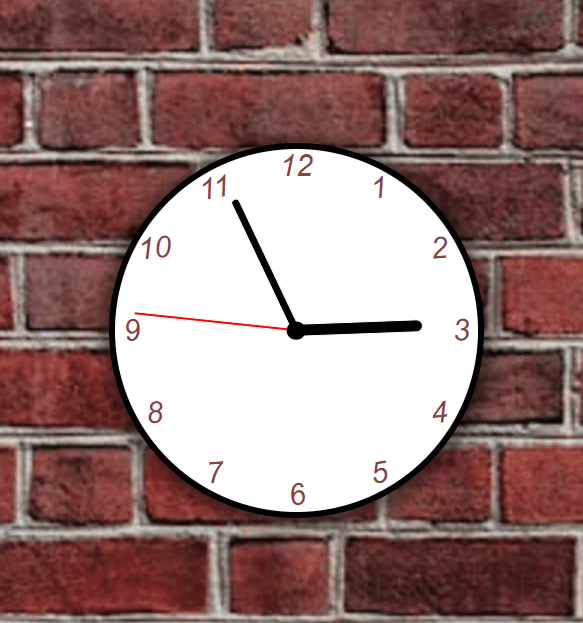

Welcome to the Analog Clock Project!

This project is a simple and elegant implementation of an analog clock using HTML, CSS, and JavaScript. The clock displays the current time in a visually appealing manner, allowing users to easily read the hour, minute, and second hands.

## Features

- Real-time Updates: The clock updates in real-time, accurately displaying the current time as it changes.
- Smooth Animation: The clock hands move smoothly and seamlessly, providing a visually pleasing experience.
- Responsive Design: The clock adapts to different screen sizes and devices, ensuring optimal viewing on desktop, tablet, and mobile devices.
- Customizable Styles: The clock's appearance can be easily customized by modifying the CSS file to match your preferred visual style.

## Demo

Here's a quick demo of the analog clock in action:
[Analog Clock Demo](https://bahaaahmed1990.github.io/analog-clock/) You can also try it out yourself by visiting the live demo!

## Usage

To use the analog clock in your own project, follow these steps:

1. Clone the repository: git clone https://bahaaahmed1990.github.io/analog-clock
2. Navigate to the project directory: cd analog-clock
3. Open the index.html file in your preferred web browser.
4. Voila! The analog clock should now be displayed on your screen.Feel free to customize the clock's appearance by modifying the styles in the styles.css file. You can adjust the colors, sizes, and other visual aspects to suit your preferences.
